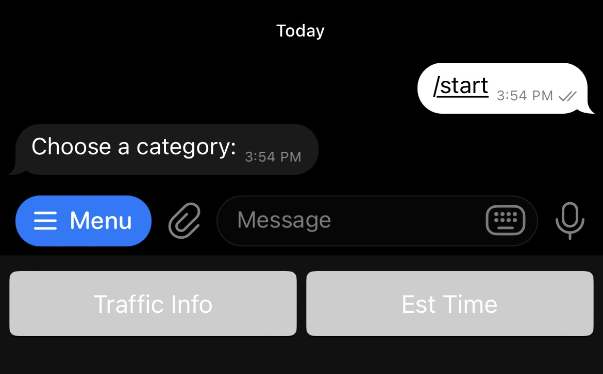

# SG Traffic Telegram Bot

## Project Overview
The SG Traffic Telegram Bot provides real-time traffic and travel information for Singapore's expressways. It integrates with the LTA DataMall API to fetch traffic incidents (e.g., accidents, roadworks) and estimated travel times. The bot delivers interactive options via Telegram, combining textual summaries and visual maps.

## Key Features

1. **Traffic Information**  
   Leveraged the LTA DataMall API to fetch real-time traffic data, including details such as incident type, latitude, longitude, and descriptive messages. (See below for example)
   - **Data Transformation**: Raw API responses are parsed into JSON and converted into a structured pandas DataFrame for efficient cleaning and processing. To extracts and organizes key information such as incident time, location, and expressway classification
   - **Incident Analysis**: Based on the categorized incidents, the bot will provides concise summaries of the traffic status along major routes for quick insights.
   - **Dynamic Visualization**: Utilized Folium to plot incidents on an interactive map of Singapore with each incident represented with markers and pop-ups, providing users with a realistic and intuitive view of affected areas.
  
       
   

2. **Estimated Travel Times**  
   Retrieves real-time travel time data for Singapore's expressways using the LTA DataMall API, providing insights such as Name, Direction, FarEndPoint, StartPoint, EndPoint & EstTime. (See below for example)  
   - **Data Transformation**: Extracts and formats key details, such as start points, end points, and route descriptions. Numerical data is converted into descriptive terms for clarity, and the information is structured into a pandas DataFrame for efficient processing and transformation.
   - **Data Presentation**: Organizes travel time data into a user-friendly format, categorizing it by expressways. Each highway's exits are individually detailed, ensuring clarity and specificity in the information provided.
   
      

3. **Interactive User Experience**
   Leveraged on pyTelegramBotAPI for features such as:
   - **Dynamic KeyboardsF**: Implements Telegram's reply keyboard markup to create an intuitive, interactive interface that dynamically adjusts based on user selections, minimizing user
   - **State Management**: Tracks user inputs and preferences to provide context-aware responses, streamlining navigation through the bot’s features.

5. **Map Visualization**
   The project make use of Webscraping and Data Visualisation techniques specifically:  
   - **Custom Maps**: Generates realistic and context-specific maps using the Folium library, enhanced with incident markers and route overlays for better clarity.
   - **Automated Screenshots**: Leverages Selenium in headless mode to render and capture high-resolution screenshots of generated maps, enabling seamless sharing on Telegram for quick and intuitive traffic insights.

## Examples of how the telebot works
Here’s a step by step on how the telebot would respond:

1. ### Main Menu Interaction
  - This screen displays the bot's initial menu after the user types the /start command. It presents two main options:
    - Traffic Info: Access real-time traffic incident details for Singapore's expressways.
    - Est Time: View estimated travel times for different expressways.

    The reply keyboard is dynamic, providing an interactive interface that eliminates manual typing and reduces errors.

    
      
2. ### Category Selection

    After selecting either Traffic Info or Est Time, the bot presents the expressways for the user to choose from (e.g., AYE, CTE, TPE). The dynamic keyboard adjusts to show all available expressways, ensuring easy navigation. A "Back" button allows users to return to the main menu seamlessly.

    

3. ### Estimated Travel Time Example

    Upon selecting Est Time and a specific expressway (e.g., TPE), the bot fetches and presents estimated travel times for various routes along that expressway.
    - Each route is described by its start point and end point.
    - The estimated time for each segment is displayed clearly.

    

4. ### Traffic Incident Example

    When the user selects Traffic Info and a specific expressway (e.g., TPE), the bot provides detailed incident reports along the selected expressway, including:
    - Time: The timestamp of the reported incident.
    - Description: Incident type (e.g., roadworks, vehicle breakdowns) and its exact location.
    - Map: A visual representation of the incident locations using Folium, helping users identify affected areas at a glance.

    The information is designed to help users avoid congestion and plan alternate routes efficiently.
    

## Conclusion
Working on the **SG Traffic Telegram Bot** has been a valuable learning experience that deepened my skills in integrating various technologies to build a functional application. Through this project, I gained hands-on experience with:

1. **API Integration**: Learning to connect to the LTA DataMall API, handle requests, and transform raw data into useful insights.  
2. **Data Processing with Pandas**: Enhancing my ability to clean, transform, and structure data efficiently for real-world applications.  
3. **Dynamic Mapping with Folium**: Creating interactive maps to visualize traffic incidents clearly and intuitively.  
4. **Automation with Selenium**: Streamlining the process of generating and sharing map screenshots using headless browsing.  
5. **Telegram Bot Development**: Improving my understanding of user interaction with dynamic keyboards and state management.

This project has helped me refine my programming skills while emphasizing the importance of simplicity and usability in delivering real-time solutions. It’s been a rewarding experience that I’m eager to build on in future projects.

